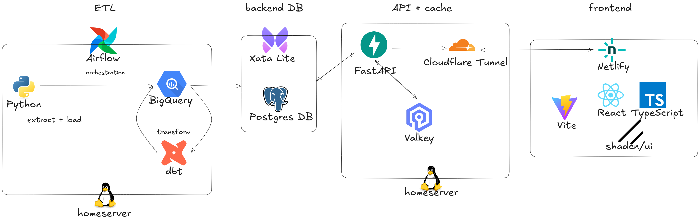

# wremotely

[https://wremotely.com/](https://wremotely.com/)

wremotely is a remote job aggregator that collects and presents remote job listings from multiple sources, making it easy to browse, search, and discover remote opportunities in one place.

---

## Overview

### 1. [frontend](https://github.com/kevinesg/wremotely-frontend)

  

- **Description:**  
  The frontend is a modern, responsive web application built with React, TypeScript, Vite, and shadcn/ui. It provides the user interface for browsing and searching remote jobs.
- **Key Features:**
  - Fast, modular UI with [React](https://react.dev/) and [shadcn/ui](https://ui.shadcn.com/)
  - Dark mode, mobile-friendly design
  - Ready for deployment on Netlify

---

### 2. [api](https://github.com/kevinesg/wremotely-api)

  

- **Description:**  
  The API backend is built with FastAPI (Python) and serves job data to the frontend and other consumers. It handles caching and database access.
- **Key Features:**
  - RESTful endpoints for job data (only GET requests for now)
  - PostgreSQL database integration
  - Redis/Valkey caching for performance
  - CORS support for frontend integration
  - Ready for deployment behind Cloudflare Tunnel

---

### 3. [etl](https://github.com/kevinesg/wremotely-etl) (private repo)

  

- **Description:**  
  The ETL (Extract, Transform, Load) module is responsible for collecting raw job data from various sources and loading it into storage for further processing (basically extract-load steps only).
- **Key Features:**
  - Scripts for extracting and storing raw job data
  - Data transformation and sync to backend storage (e.g., BigQuery, Postgres)
  - No frontend or API logic; focused solely on data ingestion

### 4. [dbt](https://github.com/kevinesg/dbt) (part of an already existing repo composed of multiple projects)

  

- **Description:**  
  Responsible for all data transformation (i.e. cleaning/formatting of raw data from all sources)

---

## Architecture

- **Separation of Concerns:**  
  Each repository is focused on a single responsibility (UI, API, or ETL), enabling modular development and easier maintenance.
- **Data Flow:**  
  ETL scripts collect and process job data → API serves processed data via REST endpoints → Frontend consumes API to display jobs to users.

---

## Limitations

- **Data Source Limitations:**

  - Data collection strictly follows the limitations and guidelines specified by each data source (e.g., frequency of data pulling).
  - Some sources do not provide complete data via their API or RSS feeds; currently, all data is sourced from API/RSS only.
  - Web scraping (for job boards and individual company sites) is planned but not yet implemented.

- **API & Cache Availability:**

  - The API and Valkey cache are deployed on a local homeserver, exposed only via Cloudflare Tunnel.
  - If the homeserver is unreachable, the API and cache will be inaccessible.
  - This approach is chosen to maintain 0 cost, as cloud providers' free Redis/Valkey tiers are insufficient for the use case.

- **API Authentication:**

  - Currently, there is **no authentication** for the public API endpoints.
  - Planned: Add a Cloudflare Worker to restrict API access.

- **Feature Scope:**

  - Only GET endpoints are currently supported in the API; there is no job posting or user account functionality.
  - The ETL repository is private, so data ingestion scripts are not publicly available.
  - Some advanced features (e.g., user sign in, fuzzy search, company pages) are under development.

- **Architecture & Cost Priorities:**
  - All architectural and deployment decisions prioritize 0 cost to run the site.
  - The stack includes: Netlify for frontend, GCP BigQuery (shared with other projects) for ELT, Xata Lite for Postgres, Valkey on homeserver for cache, and FastAPI on homeserver for the API. BigQuery usage incurs negligible cost.

---

## Contributing & Support

- For feedback, contributions, or questions, see the [Learn More](https://wremotely.com/) section in the site.
- If you find wremotely useful, consider supporting via [Ko-fi](https://ko-fi.com/kevinesg) or [PayPal](https://www.paypal.com/paypalme/kevinesg).

---

## License

MIT License. See individual repositories for details.
